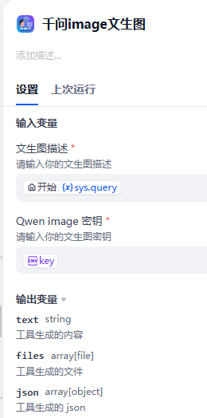
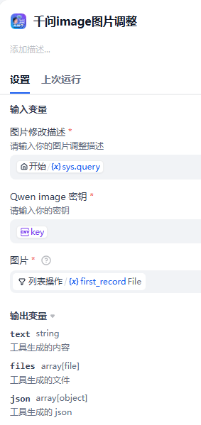

## qwentext2image

**Author:** lfenghx
**Version:** 0.0.1
**Type:** tool

### Description

Qwen-image Plugin for Dify
This plugin is specifically developed to enable Dify users to call the Qwen-image model more conveniently. By installing this plugin, you can easily invoke Qwen's text-to-image and image adjustment models. Qwen's image models possess strong text generation capabilities and semantic recognition, which will serve as a powerful aid in your creative process! For more details, please refer to the official Qwen documentation.
Tools Included in This Plugin
This plugin comprises two tools, with their parameters detailed below:
Tool 1: Qwen-image Text-to-Image

Input Parameters:
query: The description text used for text-to-image generation.
Qwen API Key: Qwen's API key (it is recommended to store the key as an environment variable when using it in workflows).
Output Parameters:
text: Provides real-time updates to help you keep track of the text-to-image generation progress.
file: The generated image file obtained after the text-to-image process is successful.
Tool 2: Qwen-image Image Adjustment

Input Parameters:
query: The description text specifying the desired image adjustments.
Qwen API Key: Qwen's API key (it is recommended to store the key as an environment variable when using it in workflows).
image: The original image that needs to be adjusted.
Output Parameters:
text: Provides real-time updates to help you keep track of the image adjustment progress.
file: The adjusted image file obtained after the image adjustment process is successful.

插件 github 仓库地址：https://github.com/lfenghx/Qwentext2image
