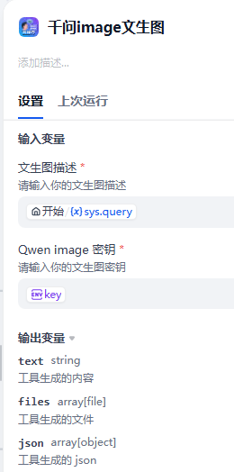

## 千问文生图插件

**作者:** lfenghx
**版本:** 0.0.1
**类型:** 工具

### Description

Dify 的通义千问图像插件该插件专为 Dify 用户设计，用于更便捷地调用通义千问图像模型。安装此插件后，你可以轻松调用通义千问的文本转图像和图像调整模型。通义千问的图像模型具备强大的文本生成能力和语义识别能力，将成为你创作过程中的有力助手！更多详情请参考通义千问官方文档。
本插件包含的工具本插件包含两个工具，其参数详情如下：
工具 1：通义千问图像 - 文本转图像

输入参数：
query：用于文本转图像生成的描述文本。
通义千问 API 密钥：
通义千问的 API 密钥（在工作流中使用时，建议将密钥存储为环境变量）。输出参数：text：提供实时更新，帮助你跟踪文本转图像的生成进度。file：文本转图像过程成功后得到的生成图像文件。
工具 2：通义千问图像 - 图像调整

输入参数：
query：用于指定所需图像调整的描述文本。
通义千问 API 密钥：
通义千问的 API 密钥（在工作流中使用时，建议将密钥存储为环境变量）。
image：需要进行调整的原始图像。
输出参数：
text：提供实时更新，帮助你跟踪图像调整的进度。
file：图像调整过程成功后得到的调整后的图像文件。
通义千问 API 密钥：
通义千问的 API 密钥（在工作流中使用时，建议将密钥存储为环境变量）。
image：需要进行调整的原始图像。
输出参数：
text：提供实时更新，帮助你跟踪图像调整的进度。
file：图像调整过程成功后得到的调整后的图像文件。

插件 github 仓库地址：https://github.com/lfenghx/Qwentext2image
联系作者：
邮箱：550916599@qq.com
vx：lfeng2529230
github：lfenghx
